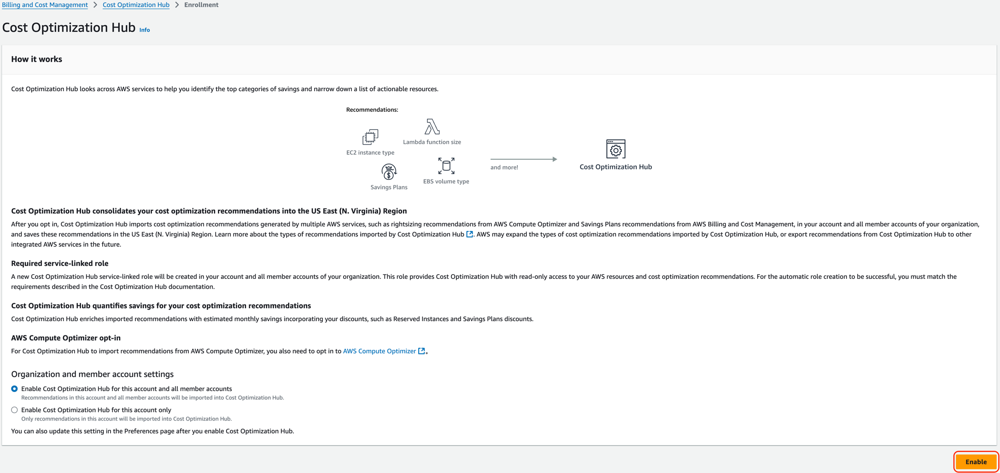
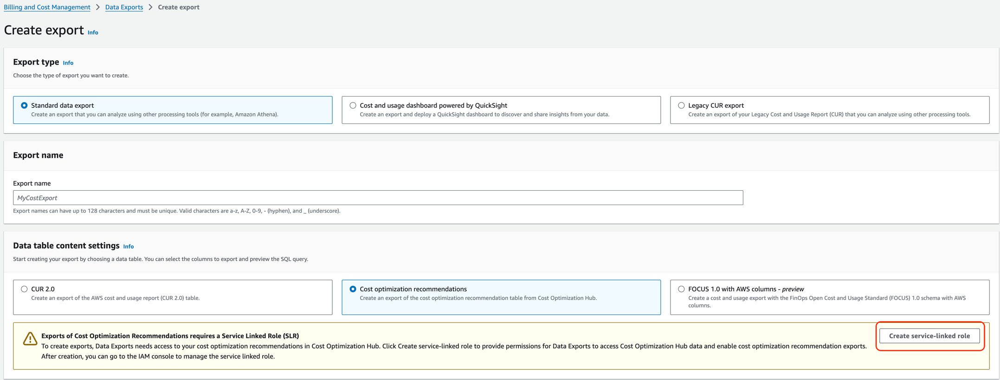

# Vertice Cloud Cost Optimization CloudFormation templates

This repository provides CloudFormation templates helping to configure
[Vertice Cloud Cost Optimization](https://www.vertice.one/product/cloud-cost-optimization)
infrastructure in your account, including:

- an IAM role allowing Vertice platform to access your resources,
- an S3 bucket to store Cost and Usage Reports (CUR) and optionally store Cost Optimization Recommendations Reports (COR),
- a Cost and Usage Report definition, and
- an AWS Data Exports report definition (COR format).

We also offer Terraform configuration of the same at
[VerticeOne/terraform-aws-vertice-integration](https://github.com/VerticeOne/terraform-aws-vertice-integration),
which supports a more fine-tuned configuration of permissions
granted to Vertice in your account.

## Using the template

> [!IMPORTANT]  
> Make sure you are in the **us-east-1** region.
> See [Region Selection](#region-selection) for explanation.</br>
> Before enabling an AWS Data Export report (COR format) through this template:
>
> - Enable **Cost Optimization Hub** in **Billing and Cost Management** in your **Billing AWS Account**:
>   
> - Create the **AWSServiceRoleForBCMDataExports** service-linked role
>   - In the AWS Console, go to the **Billing and Cost Management** page
>   - On this page navigate to **Data Exports** -> Click **Create** -> Select **Standard data export** and **Cost optimization recommendations**
>   - Now you should see a warning table with the following title: **Exports of Cost Optimization Recommendations requires a Service Linked Role (SLR)**
>     - If you don't see the warning, you have already created the **AWSServiceRoleForBCMDataExports** service-linked role.
>   - In this warning table, click the **Create service-linked role** button, and it will create the necessary role for you.
>   - You can leave the page now, without finishing the creation of the Data export, or you can continue with the settings below
>     

The [Vertice governance CloudFormation template](templates/governance.yaml) is published
to the following S3 address:

```text
https://vertice-cco-cloudformation-templates.s3.eu-west-1.amazonaws.com/vertice-governance.yaml
```

> [!TIP]
> To deploy the stack easily, use this CloudFormation [quick-create link](https://us-east-1.console.aws.amazon.com/cloudformation/home?region=us-east-1#/stacks/quickcreate?templateURL=https://vertice-cco-cloudformation-templates.s3.eu-west-1.amazonaws.com/vertice-governance.yaml) and populate all of the fields.

Alternatively, [create a new CloudFormation Stack](https://docs.aws.amazon.com/AWSCloudFormation/latest/UserGuide/using-cfn-cli-creating-stack.html),
providing the URL above as the `--template-url` parameter (or `Amazon S3 URL`
in the AWS console).

### Region selection

As documented [in this upstream issue](https://github.com/aws-cloudformation/cloudformation-coverage-roadmap/issues/1825),
the AWS CUR functionality is limited to the `us-east-1` region. Therefore, you must deploy this template to that region to ensure smooth operation.

If you chose not to create the CUR report, S3 bucket or other resources using this CloudFormation template, then please create those resources first and then input the details when using this CloudFormation to complete the final setup steps.

### Parameters

#### Required parameters

##### AccountType

supports the following values:

- `billing` (CUR with S3 bucket should be configured in the account);
- `member` (IAM role should be allowed to monitor your AWS services); or
- `combined` (both `billing` and `member` resources should be set up).

##### BillingBucketName

The **BillingBucketName** will be required in order for the role to have the correct policy.

##### VerticeSTSExternalID

The Unique identifier provided to you for the Vertice platform to assume the IAM role in your account.

#### Optional parameters

The creation of specific resources is further controlled by the
**BillingReportCreate**, **BillingBucketCreate**, **DataExportCreate**, and **VerticeIAMRoleCreate**
parameters.
Please see the `Parameters` section of the template for further details.

##### BillingReportSplitCostAllocationData

The template supports the [Split Cost Allocation Data](https://aws.amazon.com/blogs/aws-cloud-financial-management/improve-cost-visibility-of-amazon-eks-with-aws-split-cost-allocation-data/) opt-in feature of the Cost and Usage Report, which provides more granular data for ECS/EKS usage. Please note that this feature may increase your costs slightly due to a larger volume of usage data generated.

To enable this feature:

1. Opt in to Split Cost Allocation Data in the [Cost Management Preferences](https://us-east-1.console.aws.amazon.com/costmanagement/home?region=eu-west-1#/settings) page of the AWS Console (Step 1 of the guide linked above).
2. Set the `BillingReportSplitCostAllocationData: true` parameter on this module.

## Removing Vertice Resources

In order to remove Vertice resources from your environment you simply need to delete the CloudFormation Stack from the [us-east-1](https://us-east-1.console.aws.amazon.com/cloudformation/home?region=us-east-1#/stacks?filteringText=&filteringStatus=active&viewNested=true) region.

This will remove all resources created through the CloudFormation template.
